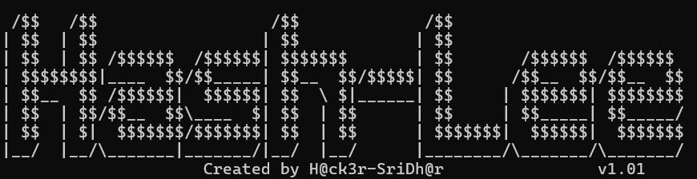
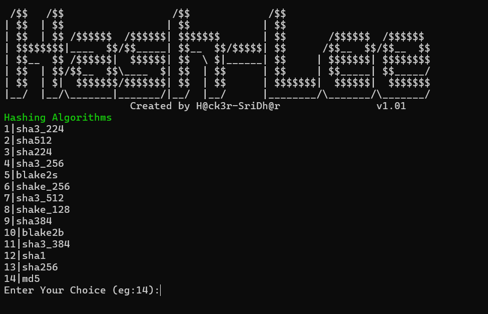

<h1 align="center">
    
    <br>
  </h1>
  
  <h3 align="center">Fast passive Hash Cracking Tool..</h3>
  
  
 
  
  <p align="center">
    <a href="#Features">Features</a> •
    <a href="#Installation">Install</a> •
    <a href="#Usage">Usage</a> •
   
  </p>
  
  ---
  
  
  `Hash-Lee` is a Hash Cracking Tool  that returns valid Value for the Hash from the given WordList, using Python. It has a simple, modular architecture and is optimized for speed. `Hash-Lee` is built for
  doing one thing only - Cracking Hashes, and it does that very well.
  
   **Hahing Algoriths Supported for Cracking**:`sha1()`, `sha224()`, `sha256()`,` sha384()`,` sha512()`, `sha3_224()`, `sha3_256()`, `sha3_384()`, `sha3_512()`, `shake_128()`, `shake_256()`,` blake2b()`,  `blake2s()`and ` md5()` 
   If you're having a Hashvalue You could crack it,with your own wordlist using **Hash-Lee**
  # Features
  
  <h1 align="left">
    </a>
    <br>
  </h1>
  
  - Fast and powerful Hashing algorithms
  - Multiple Hashing algorithms 
  - **Custom Wordlist** can be Used
  
  
  # Usage
  For **Windows**
  ```sh
  cd Hash-Lee
  python HashLee.py <Wordlist> <HashValue>
  ```
 For **Linux**
   ```sh
  cd Hash-Lee
  python3 HashLee.py <Wordlist> <HashValue>
  ```
  
  # Installation

  For Linux
  ```sh
   git clone https://github.com/Hacker-SriDhar/Hash-Lee.git
  ```
  

  
  
  
